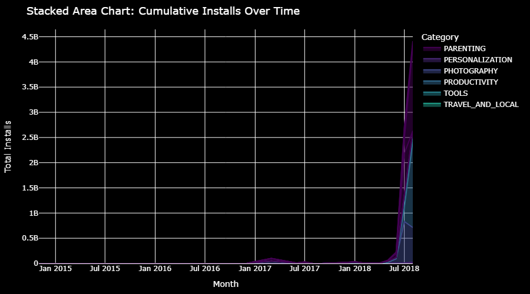
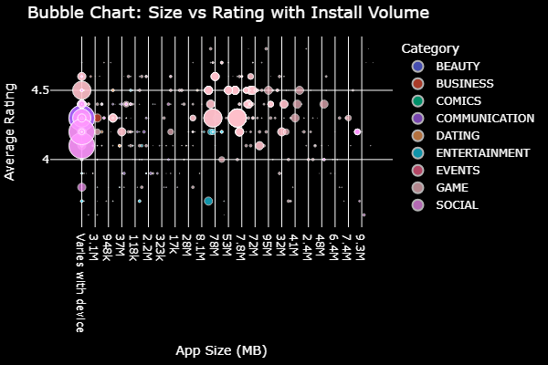
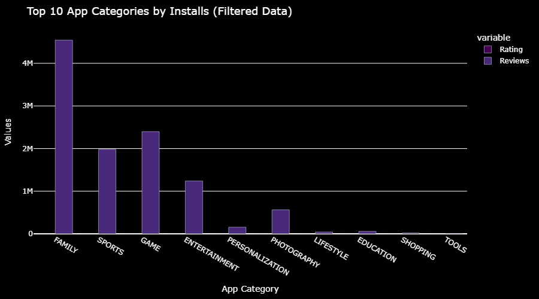
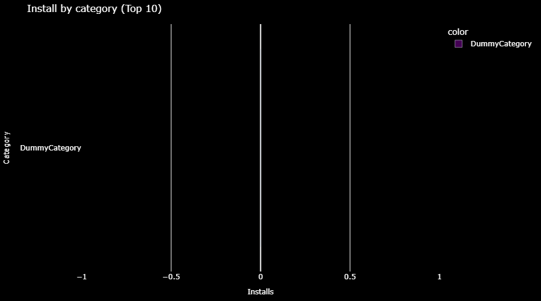

# 📊 Google Play Store Data Analysis

## 📌 Project Overview
This project analyzes Google Play Store app data to uncover insights about app performance, ratings, pricing, and category trends.

The goal is to perform data cleaning, exploratory data analysis (EDA), and visualization to understand what makes an app successful.

---

## 🎯 Problem Statement

- Which app categories are most popular?
- Do paid apps perform better than free apps?
- What factors influence app installs?
- How are ratings distributed across apps?

---

## 🛠️ Tools & Technologies

- Python
- Pandas
- NumPy
- Matplotlib
- Seaborn
- Jupyter Notebook

---

## 🔄 Project Workflow

### 1. Data Cleaning
- Removed missing values
- Handled inconsistent data
- Converted columns to correct formats

### 2. Exploratory Data Analysis
- Category-wise analysis
- Ratings distribution
- Free vs Paid apps comparison

### 3. Visualization
- Bar charts
- Pie charts
- Distribution plots

---

## 📈 Key Insights

- Free apps have more installs than paid apps
- Game and Family categories dominate
- Higher ratings = better engagement
- Price has less impact on ratings

---

## 📷 Sample Visualizations

---

## ▶️ How to Run

1. Clone the repository:
git clone https://github.com/aniket-mendhe/Google-Play-Store.git

2. Install libraries:
pip install pandas numpy matplotlib seaborn

3. Run the notebook

---

## 🚀 Future Improvements

- Build Power BI dashboard
- Add machine learning model
- Deploy project online
